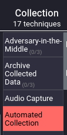

# THM Trooper Write-Up

This is a write-up for the [Trooper Room](https://tryhackme.com/r/room/trooper) on [TryHackMe](https://tryhackme.com/).
Make sure to check out TryHackMe and learn more about them on their website.

**I encourage everyone to perform the given tasks themselves**, but in the past I found write-ups useful myself in case I got stuck or my answer was not in the right format.

Before starting with the task(s) make sure to start AttackBox and the attached virtual machine by click the "Start Machine" button.
When the machine is fully loaded, access the OpenCTI-Platform and ATT&CK Navigator via the AttackBox with the given credentials.

# Task 1 - Who's The Threat?
Before diving into the questions, make sure to read the given APT X Report - it makes answering the questions much easier.
Also open the OpenCTI-Platform interface and the ATT&CK Navigator on the AttackBox.

## What kind of phishing campaign does APT X use as part of their TTPs?
APT X Report: "The group was reportedly using **spear-phishing emails** with weaponized attachments to exploit known vulnerabilities"

## What is the name of the malware used by APT X?
APT X Report : "The group employs **USBferry**, a USB malware that performs different commands on specific targets, maintains stealth in environments, and steals critical data through USB storage."

## What is the malware's STIX ID?
Search for the malware's name in the OpenCTI interface and find the answer in the Overview tab.

## With the use of a USB, what technique did APT X use for initial access?
Switch to Knowledge tab and check APT X's timeline.

## What is the identity of APT X?
If you paid attentation you have already stumbled across the identity of APT X in the OpenCTI interface.
You can find the answer in the details field in the Overview tab of the used malware.

## On OpenCTI, how many Attack Pattern techniques are associated with the APT?
Search for the name of the real identity of APT X in the OpenCTI interface and switch to the Knowledge tab.

## What is the name of the tool linked to the APT?
Stay on the site of the APT and click on `Tools` in the right sidebar.

## Load up the Navigator. What is the sub-technique used by the APT under Valid Accounts?
Visit the ATT&CK Navigator on the AttackBox and expand the `Valic Accounts` field.

## Under what Tactics does the technique above fall?
Right-click the technique in the navigator and click `view technique`.
This opens the technique's MITRE ATT&CK page with the answer.

## What technique is the group known for using under the tactic Collection?
Check the `Collection` column in the navigator.

